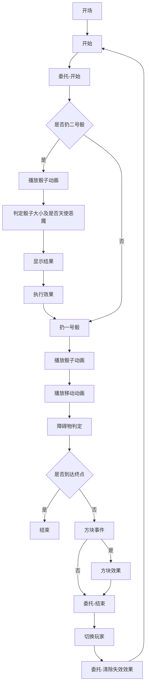

 # RTF策划案

## 游戏介绍

RTF是一款双人回合制类大富翁游戏，玩家靠骰子的使用来前进和阻碍对方前行，谁先跨过多重障碍并到达终点为成功。

## 地图

约200个格子，地块设有障碍、机遇、陷阱、危险四种

## 游戏流程

### 障碍

需要玩家进行进行骰子判定，若判定成功（大于3）则继续前行，反之则停下，不会因为玩家通过而消失

### 随机事件（机遇、危险）

共用同一种地块，但是机遇会为玩家提供增益而后者则是给玩家上debuff（需详细设计）

### 陷阱

需要运用骰子进行判定，判定成功（大于4）使骰子变为八面骰，失败则变为四面骰，持续两回合，玩家经过后消失

## 骰子设计

玩家拥有两个骰子，其中一个（一号骰）用于前行，一个（二号骰）根据掷出来的结果来判定结果。

骰子存在全是一面骰、四面骰、六面骰、八面骰、全是六面骰（等级按此顺序上升），会根据不同事件发生改变。

二号骰则会根据扔出的大小来产生效果，1－3为对自身debuff或对对方加成，4－8为自身增益或对方debuff。同时扔骰子还会有概率扔出“天使骰”或“恶魔骰”，大体效果和上方相对应但是效果大大增强。  

### 二号骰

两回合一刷新  

概率仅天使和恶魔各为2％，剩余点数均分  

当出现随机分配或挑选增益或负面效果，即在下方详细内容内抽取  

天使骰（幸运骰）2％：随意挑选一个增益/直接前进十格/抵消未来两次的负面效果/取消对方下一次的增益/向对方指定地块打出闪电使该地块变为陷阱，且该陷阱必须骰子大于等于6才可以判定成功/使对方马上进行一次判定，若点数小于等于3，则移动回上回合位置   

掷出6（或以上）：对方两回合内反向移动/无论什么骰子，对方骰子只能扔出1-4两回合/对方两回合内遇到障碍或陷阱或判定事件必定失败/自身骰子变为全六面一回合/自身两回合内遇到障碍或陷阱或判定事件必成功/自己往后三回合内每次掷骰子得到点数均加1  

掷出5 ：将对方骰子全部降低一个等级（全六→八面→六面→四面→全一），若已为最低则自身前进五格/将对方前方两个地块变为障碍地块/对方两回合内进入机遇地块必为危险地块/将自己骰子全部上升一个等级，若已为最高则自身前进五格/让自己下次遇到陷阱判定成功变为大于等于4  

掷出4 ：降低对方特定点数刷新概率5％，平均分配到123点内（两种骰子选一种）/将对方前第三个变为障碍地块/对方两回合内进入机遇地块无反应/增大自己特定点数刷新概率5％，平均分配到456点内（两种骰子选一种）

掷出3： 降低自身特定点数刷新概率5％，平均分配到123点内（两种骰子选一种）/将自身前第三个变为障碍地块/自身两回合内进入机遇地块无反应/增大对方特定点数刷新概率5％，平均分配到456点内（两种骰子选一种）

掷出2： 将自身骰子全部降低一个等级（全六→八面→六面→四面→全一），若已为最低则自身后退五格/将自身前方两个地块变为障碍地块/自身两回合内进入机遇地块必为危险地块/将对方骰子全部上升一个等级，若已为最高则对方前进五格/让对方下次遇到陷阱判定成功变为大于等于4  

掷出1： 自身两回合内反向移动/无论什么骰子，自己骰子只能扔出1-4两回合/自己两回合内遇到障碍或陷阱或判定事件必定失败/对方骰子变为全六面一回合/对方两回合内遇到障碍或陷阱或判定事件必成功/对方往后三回合内每次掷骰子得到点数均加1   

恶魔骰（厄运骰）2％：随机获得两种负面增益/接下来五回合判定必定失败/对方下一次增益翻倍/自己前方路面出现三个陷阱/三回合内自身遇到随机事件地块必定刷出来危险/召唤火球，使某些地块消失  

## 事件地块设计
！！以下所有的事件均需要判定而非直接获得！！
增益事件：

天使的祝福：获得额外一个天使骰子

再来一次：获得额外一个普通骰子 

~~时间倒流：获得一次重掷骰子的机会~~

天使的加护：使下一次恶魔骰子对自己失效  

作弊码:使下一次判定必定通过

祝福！：使自己的行动骰子面数等级上升一级

~~祝福！：使自己的判定骰子等级上升一级~~

恶性事件：

显灵：使恶魔骰子马上触发 

恶魔的诅咒：使自己下回合无法移动 

（如果超越对手20格才可能触发这一事件）迷失：两回合内，自己的下一颗移动骰子将变成往回走

命运多舛：使自己面前刷新一个障碍物

诅咒！：使自己的行动骰子面数下降一级

~~诅咒！：使自己的判定骰子面数下降一级~~

中立事件 1.（大挑战） 尽你可能地进行判定吧！ 可以选择参加/不参加挑战 不参加挑战则该事件不触发 1~8依次递增为2、4、6、8面骰子，面数越多触发的效果越多

1.	让对手增加一颗普通骰子
2.	让自己增加一颗普通骰子
3.	让自己触发一颗恶魔骰子
4.	让对手触发一颗恶魔骰子
5.	让自己触发一颗天使骰子
6.	让对手触发一颗天使骰子
7.	让自己的下次判定必定成功
8.	让自己的下次判定必定失败

2.神秘的地块 增加一些趣味buff
1.	踩中这个地块将使两名玩家在接下来的三回合中使掷出的骰子都翻面 比如六面骰子 掷出1后会翻面变成6

3.想要与恶魔交易吗？
1.	获得一颗天使骰子 代价是骰子的面数下降一个等级
2.	使行动骰子等级上升一级 代价是接下来将进行三次判定 每次判定失败都将在面前新增一个障碍物
3.	使对手强制触发一颗恶魔骰子 代价是三回合内行动骰子将变为二面骰

## 玩家操作

鼠标点击

## 玩家页面

随时存在一个圆盘会显示扔出各点数的概率
